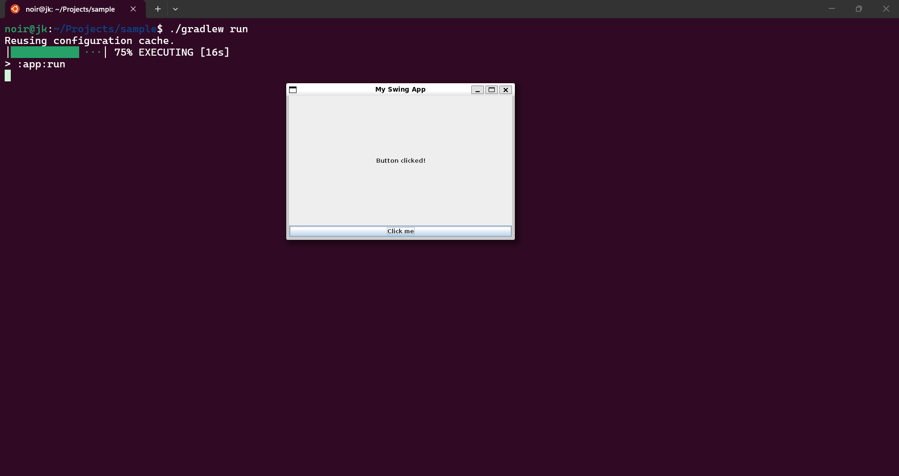

# ☕ Java Swing + Gradle (WSL2 Setup)



This project demonstrates a Java Swing desktop application running on **WSL2 (Windows Subsystem for Linux)** using **Gradle** as the build system.

---

# 🚀 Tech Stack

- Java 25
- Gradle 9
- Swing (Java GUI toolkit)
- WSL2 (Ubuntu on Windows 10/11)

---

# 🧱 Project Structure
```bash
sample/
├── app/
│ └── src/main/java/org/example/App.java
├── build.gradle
├── settings.gradle
├── gradlew
├── gradlew.bat
└── gradle/wrapper/
```

---

# ⚙️ Requirements

## 1. Install WSL2 (Windows)
Enable WSL and install Ubuntu.

## 2. Install Java (inside WSL)
```bash
sudo apt install openjdk-25-jdk
curl -s "https://get.sdkman.io" | bash
sdk install gradle
```

---

🚀 Run the Project
From project root:
```bash
./gradlew run
```
